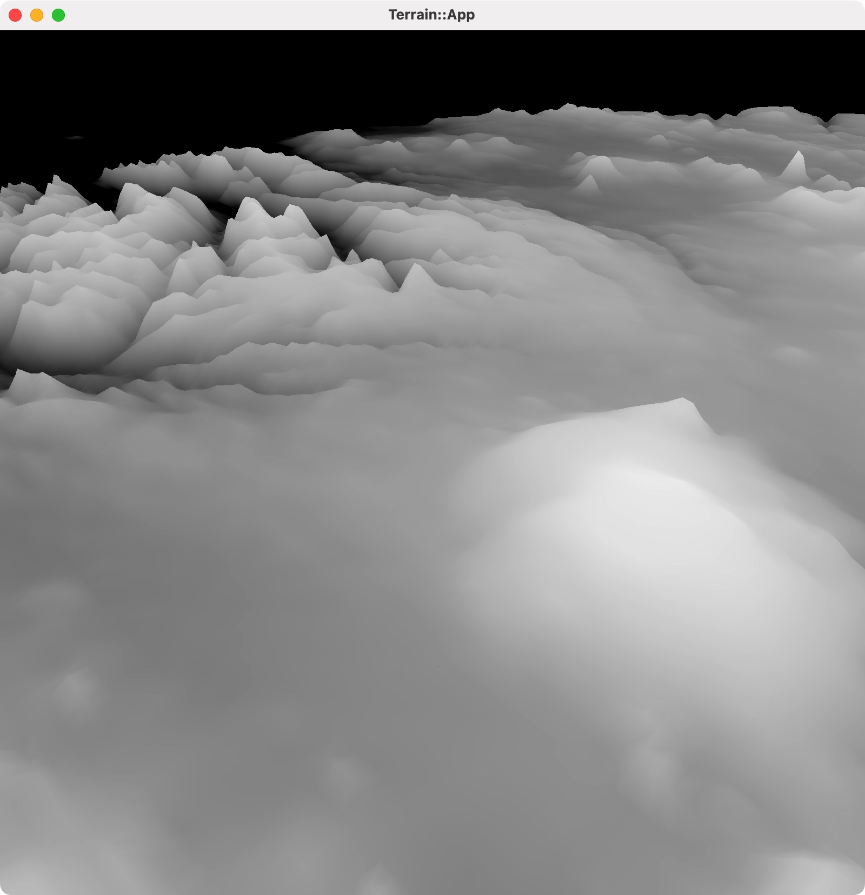
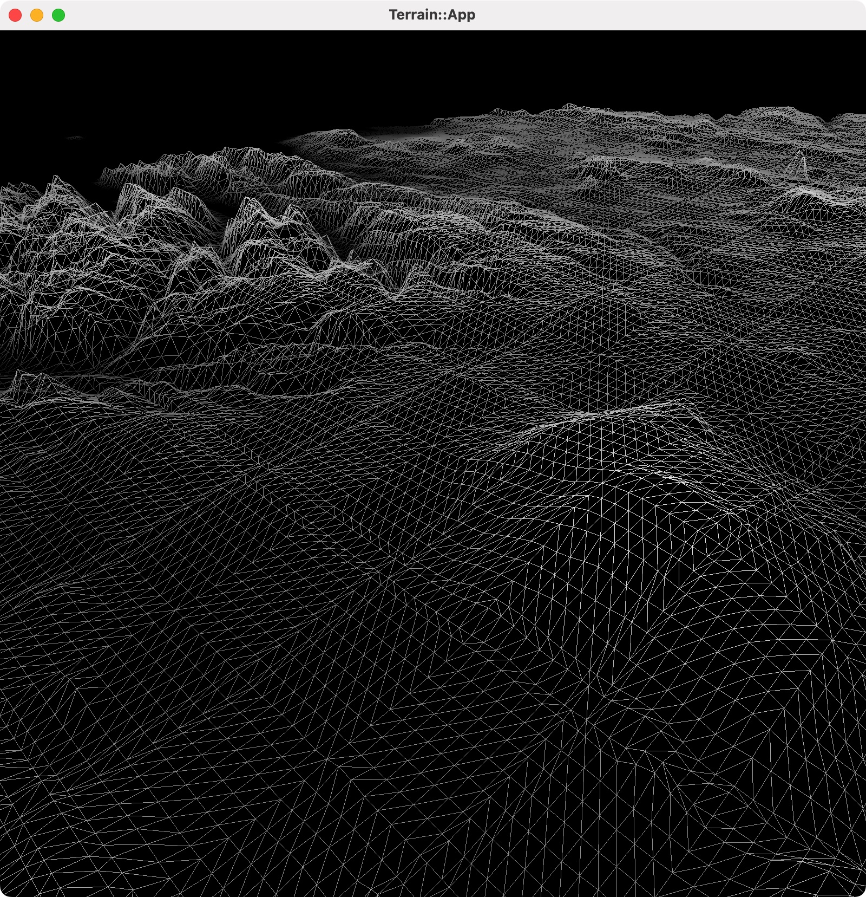

This is my real-time renderer, which I use to learn Rulkan and real-time rendering techniques.

### Todo List

- [x] learn vulkan tutorial
- [x] application base framework
- [x] hello triangle
- [x] mass and mipmap
- [ ] compute shader:
    - [x] particles
- [ ] tesselation shader
    - [x] height map based terrain
- [ ] shadow map
- [ ] pcss, pcf
- [ ] ssao, ssdo
- [ ] ssr

### Compute Shader

compute shader + particles 实现简单的曲面动画

### Tesselation Shader

利用冰岛的高度图和 tesselation shader 生成地形

